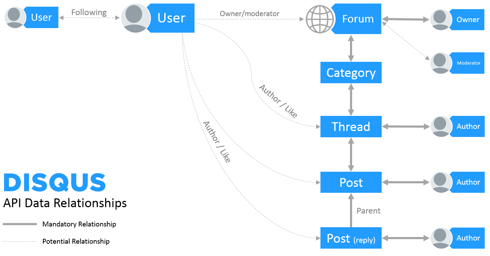

# gisqus - a thin wrapper over Disqus' API, written in Go.

[](https://opensource.org/licenses/Apache-2.0)
[](http://godoc.org/github.com/pierods/gisqus)
[](https://goreportcard.com/report/github.com/pierods/gisqus)
[](https://travis-ci.org/pierods/gisqus)

Gisqus is a Go wrapper over Disqus' public API (https://disqus.com/api/docs/). Its main purposes are to wrap away REST calls, http error handling and modeling of the data returned.

Gisqus only covers endpoints that read data (GET method), not the ones writing data. It is mainly meant for reporting purposes.
For this reason: 
* it only supports authentication in the form of "Authenticating as the Account Owner" (https://disqus.com/api/docs/auth/)
* endpoints that require entity IDs (thread ID, forum ID etc) but where they can be provided implicitly by authentication have their wrappers 
  requiring those parameters explicitly in the method signature

The "related" parameter in many Disqus endpoints is not supported, since data returned through it can always be gotten with a direct call to the 
respective api. In this sense, Gisqus covers the complete hierarchy of Disqus' object model.


### Usage
After having obtained an API key from Disqus (you must create an app for that on Disqus' control panel), one must obtain an instance of Gisqus:

```Go
    import  "context"
    import  "net/url"
    import  "github.com/pierods/gisqus"
    ...
    g = NewGisqus("api key")
    values := url.Values{}
    ctx, cancel := context.WithCancel(context.TODO())
```

One can then proceed to make calls against Disqus' endpoints. Calls do not support timeouts, but they are cancellable (https://golang.org/pkg/context/).

```Go
    values.Set("filters", gisqus.PostIsAnonymous)
    posts, err := g.PostList(ctx, values)
    if err != nil {
        ...
    }
    fmt.Println(posts.Response[0].ID)
```
### Notes
All calls are cancellable, so they won't catastrophically block on a call chain.

The complete Disqus hierarchy is modeled:




except for Categories, since the vast majority of forums use only one category for all posts.

Some Disqus constants have been replicated to avoid having to memorize lists of values:
```Go
// Post constants are used by Disqus in API calls in the "filters" parameter
const (
	PostIsAnonymous = 1 + iota
	PostHasLink
	PostHasLowRepAuthor
	PostHasBadWord
	PostIsFlagged
	PostNoIssue
)
// Post constants are used by Disqus in API calls in the "include" parameter
const (
	PostIsUnapproved  = "unapproved"
	PostIsApproved    = "approved"
	PostIsSpam        = "spam"
	PostIsDeleted     = "deleted"
	PostIncludedIsFlagged     = "flagged"
	PostIsHighlighted = "highlighted"
)
// Intervals are used by Disqus in API calls in the "since" parameter
const (
	Interval1h  = "1h"
	Interval6h  = "6h"
	Interval12h = "12h"
	Interval1d  = "1d"
	Interval3d  = "3d"
	Interval7d  = "7d"
	Interval30d = "30d"
	Interval90d = "90d"
)
// Order constant are values used by Disqus in API calls in the "order" parameter
const (
	OrderAsc  = "asc"
	OrderDesc = "desc"
)
// Sort constants are values used by Disqus in API calls in the sortType parameter
const (
	SortTypeDate     = "date"
	SortTypePriority = "priority"
)
```


### Endpoints covered
https://disqus.com/api/docs/
##### Forums
* details
* interestingForums
* listCategories
* listFollowers 
* listMostActiveUsers
* listMostLikedUsers
* listThreads
* listUsers

##### Threads
* details
* list
* listHot 
* listPopular 
* listPosts
* listUsersVotedThread
* set

##### Posts
* details
* getContext 
* list
* listPopular

##### Users
* details 
* interestingUsers
* listActiveForums
* listActivity 
* listFollowers 
* listFollowing 
* listFollowingForums 
* listMostActiveForums 
* listPosts
